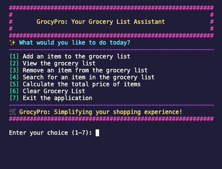

# Grocery-CLI

A command-line tool for managing your grocery list, featuring an interactive Beginner Mode and a somewhat powerful Dev Mode for advanced users.

Here's a simplified setup guide tailored for a shell script:

---

## Setup Instructions

To get started with the **Grocery-CLI**, follow these simple steps:

### 1. **Download the Script**

- Clone the repository.

  ```
  git clone https://github.com/Programming-Sai/Grocery-CLI.git
  ```

- Navigate into it.

  ```bash
    cd Grocery-CLI
  ```

### 2. **Make the Script Executable**

Before running the script, you need to give it executable permissions.

In your terminal, navigate to the directory where the `grocery_easy.sh` or `grocery_dev.sh` file is located, then run:

```
chmod +x grocery_easy.sh

# OR

chmod +x grocery_dev.sh
```

### 3. **Run the Script**

Once the script is executable, you can run it directly in your terminal:

```
./grocery_easy.sh

# OR

./grocery_dev.sh <command> [options]

```

The script will start, and you will be guided through the available commands.

---

## Easy Section (Non-Dev Mode)



The **Easy Section** is designed for users who prefer a simple and intuitive interface to manage their grocery list. It guides you step-by-step through the process of adding, displaying, searching, and deleting items from your list, all without needing any prior technical knowledge. Here's how it works:

> [!NOTE]
> Make sure to select an Option from the welcome screen in order to use the functions.

### Available funcitons

- **add**: Adds a new item to your grocery list. You will be prompted to enter the name, price, and quantity of the item.
  - Example: `add`
- **display**: Shows all items in your grocery list in a formatted table.
  - Example: `display`
- **search**: Search for an item by its name. You will be asked to enter a search term, and the tool will display matching items.
  - Example: `search <item_name>`
- **delete**: Deletes an item from the list. After searching for an item, you'll be asked to confirm deletion.

  - Example: `delete <item_name>`

- **total**: Displays the total cost of all items in your grocery list.

  - Example: `total`

- **clear**: Clears all items from the grocery list after confirming the action.
  - Example: `clear`

### Example Usage

1. **Adding an Item**

   ```
   add

   Please enter the name of the Item: Apples
   Please enter the price of the Item: 1.99
   Please enter the quantity of the Item: 2
   Are these what you want to add to the grocery list? (y/n) y
   Item Added Successfully
   ```

2. **Displaying Items**

   ```
   display

   Item Name      Item Quantity    Item Price
   --------------------------------------------
   Apples         2                1.99
   ```

3. **Searching for an Item**

   ```
   search Apples

   Item Name      Item Quantity    Item Price
   --------------------------------------------
   Apples         2                1.99
   ```

4. **Deleting an Item**

   ```
   delete Apples

   Are you sure you want to remove this item from the grocery list? (y/n) y
   Item successfully deleted.
   ```

5. **Getting the Total**

   ```
   total

   Total: 1.99
   ```

6. **Clearing the List**

   ```
   clear

   Are you sure you want to clear the storage? (y/n) y
   Storage Cleared
   ```

This section makes it easy for non-dev users to quickly start managing their grocery lists without getting into the complexities of the more advanced features.

---

## Dev Mode

Dev Mode allows you to run the grocery tool in a more advanced, command-line style, similar to how version control tools like Git are used. It provides a more flexible and hands-on experience, where users interact directly with commands and options, enabling efficient management of tasks like adding, displaying, and deleting items in the grocery list. This mode is suited for users who are familiar with command-line interfaces and prefer a more granular control over their operations.

### Commands in Dev Mode

The following commands are available in Dev mode:

#### 1. **add** `<item_name>` `<item_price>` `<item_quantity>`

- Adds a new item to the grocery list.
- **Parameters**:
  - `item_name`: The name of the grocery item (e.g., "Apples").
  - `item_price`: The price per unit of the item (e.g., "2.5").
  - `item_quantity`: The number of items being added to the list (can be a positive integer or `-1` for undefined quantity).
- Example:
  ```bash
  ./grocery_dev.sh add "Apples" 2.5 10
  ```

#### 2. **display**

- Displays the list of all items currently in the grocery list with their quantities and prices.

#### 3. **search** `<item_name>`

- Searches for an item by its name and displays its details (if it exists in the list).
- Example:
  ```bash
  ./grocery_dev.sh search "Apples"
  ```

#### 4. **delete** `<item_name>`

- Deletes an item from the grocery list based on the specified name.
- Example:
  ```bash
  ./grocery_dev.sh delete "Apples"
  ```

#### 5. **total**

- Displays the total cost of all items in the grocery list.
- Example:
  ```bash
  ./grocery_dev.sh total
  ```

#### 6. **clear**

- Clears all items from the grocery list. This command removes all records from the list, so be careful when using it.
- Example:
  ```bash
  ./grocery_dev.sh clear
  ```

#### 7. **--help** or **-h**

- Displays a help message detailing the usage of the Dev mode commands.
- Example:
  ```bash
  ./grocery_dev.sh --help
  ```

### Debugging and Error Handling

Dev Mode will show detailed messages when errors occur or invalid inputs are provided, helping you identify and fix issues quickly.

For example:

- If you enter a non-numeric value for price or quantity, you'll get a helpful error message indicating the issue.
- Missing or incorrect arguments will result in a usage guide being displayed, showing the correct format for the command.

### Example Usage in Dev Mode

1. **Adding Items**:

   ```bash
   ./grocery_dev.sh add "Tomatoes" 3.5 10
   ```

2. **Displaying Items**:

   ```bash
   ./grocery_dev.sh display
   ```

3. **Calculating Total**:

   ```bash
   ./grocery_dev.sh total
   ```

4. **Searching for an Item**:

   ```bash
   ./grocery_dev.sh search "Tomatoes"
   ```

5. **Deleting an Item**:

   ```bash
   ./grocery_dev.sh delete "Tomatoes"
   ```

6. **Clearing the List**:

   ```bash
   ./grocery_dev.sh clear
   ```

7. **Help Command**:
   ```bash
   ./grocery_dev.sh --help
   ```

---
